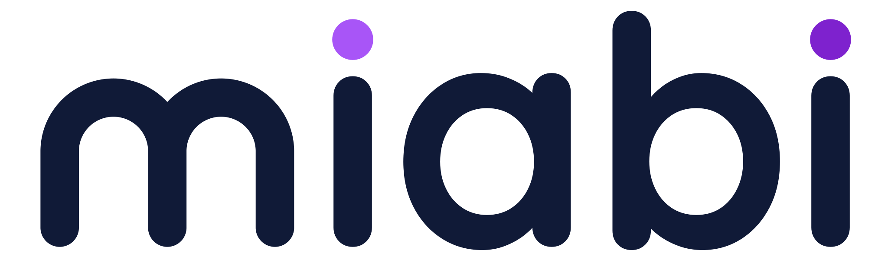

  <picture>
    <source media="(prefers-color-scheme: dark)" srcset="miabi-wordmark-white.svg">
    
  </picture>

Official [Miabi](https://github.com/miabi-io/miabi) logo assets, provided for
public use — articles, slide decks, "works with Miabi" badges, integration
docs, and similar. Please read [`LICENSE`](LICENSE) before using them.

## Assets

| File | Use it for |
|------|------------|
| [`miabi-wordmark.svg`](miabi-wordmark.svg) | Full logo (mark + wordmark) on **light** backgrounds. |
| [`miabi-wordmark-white.svg`](miabi-wordmark-white.svg) | Full logo on **dark** backgrounds. |
| [`miabi-mark.svg`](miabi-mark.svg) · [`miabi-mark.png`](miabi-mark.png) | The symbol only (gradient) — favicons, avatars, tight spaces. |
| [`miabi-mark-white.svg`](miabi-mark-white.svg) | The symbol only, solid white — for dark/colored backgrounds. |
| [`miabi-logo.svg`](miabi-logo.svg) · [`miabi-logo.png`](miabi-logo.png) | App icon (rounded square, **purple** — primary). |
| [`miabi-logo-navy.svg`](miabi-logo-navy.svg) · [`miabi-logo-navy.png`](miabi-logo-navy.png) | App icon, **navy** variant. |

SVG is preferred (scales cleanly). PNGs are provided for tools that don't accept
SVG (mark ≈ 512 px, navy icon ≈ 1024 px).

## Which one?

- **Referring to Miabi in text/docs** → a wordmark (`miabi-wordmark*.svg`).
- **App/tile/avatar** → an icon (`miabi-logo*`).
- **Favicon / very small / single-colour** → a mark (`miabi-mark*`).
- Pick the **white** variant on dark backgrounds, the default on light ones.

## Brand colors

| | Hex |
|-|-----|
| Navy (primary) | `#101A37` |
| Purple (accent) | `#9333EA` — gradient `#A855F7` → `#7E22CE` |

## Usage guidelines

**Do**
- Keep clear space around the logo (at least the height of the mark's stroke).
- Use the provided files as-is; scale proportionally.
- Use a variant with enough contrast against its background.

**Don't**
- Recolor, rotate, stretch, add effects, or redraw the mark.
- Use the logo to imply endorsement, partnership, or that your product **is**
  Miabi.
- Use it as your own app/product/organization icon.

See [`LICENSE`](LICENSE) for the full terms.
